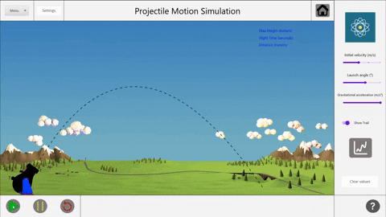

# **PHYSNICS**
## Program for Handling Your Scientific Needs In a Concise Simulation
#### An application containing 4 simulations for the user to explore. PHYSNICS includes a **stacked block simulation**, a **uniform circular motion simulation**, a **conservation of energy simulation**, and a **projectile motion simulation**. Interact with the simulations to learn how these physical concepts work. Learn physics with **PHYSNICS**!!
---
## **Stacked block Simulation**
## Description
The stacked block simulation simulates a physics problem involving two blocks one on top of the other. 


## Technical Description
Enter desired values for forces and their angle on each block along with the friction coefficient of the floor and between the top and bottom block. Toggling the vectors will allow for the visualization of the forces through their angles and magnitude. When the **play** is pressed, the blocks will move if the forces were large enough to overcome friction. Is the simulation too hard on the eyes? Hit the **moon** icon to switch the simulation into dark mode. You can also view another simulation or head to the main menu through the **Menu** tab.

## Science Concepts
This simulation uses the physics concepts of **forces** to find the total force upon each block and determining whether there is a sufficient net force to overcome friction. The forces can be applied at angles so the x and y components need to be calculated. 

) 

---

## **Uniform Circular Motion Simulation**
### **Description**
The Uniform Circular Motion Simulation involves an object in a revolving path and seeing how its centripetal acceleration and force are affected by certain parameters, the speed, radius, and mass.


### **Technical Description**
When first booting up the simulation, there are three parameters: radius, speed, and mass, with their respective sliders and textfields. Set the sliders and textfields to any desired non-negative value, given the limit: the limit is 10000 for all three textfields, and the radius must be at least 1. When ready, click on the **play** button. All values pertaining to the angle, acceleration, the force, and their components are displayed and change dynamically.  When desiring to pause, click on the **pause** button. When the user desires to reset, then the **reset** button can be clicked on. The menu button **Edit**, when clicked on, shows a **Change Path Color** button. Click on this button, and the path can be set to any desired color. If a user wishes to hide either the force and acceleration vector, they can be hidden using their respective CheckBoxes. The **Menu** button is used to change to another simulation or quit the application.

### **Scientific Concepts**
This simulation relies on the concept of **uniform circular motion**, which is when an object is revolving in constant motion without any external forces acting upon it. The
centripetal acceleration and the centripetal force that this object will experience in uniform circular motion will be pointed inwards, towards the middle of the path that it is revolving about. There are three factors that influence the acceleration and force of the object in an uniform circular motion: the **speed**, the **radius of the revolving path**, and the **mass**. They are related to the acceleration and force by two formulas: a=v^2/r, and Newton's second Law, F=ma. In this simulation, the parameters that can be affected are the speed, mass and radius, which will affect the paths size, the centripetal acceleration, and the centripetal force.


---

## **Conservation of Energy Simulation**
## Description
The convervation of energy simulation simulates a ball rolling up and down a semi-circular ramp without friction, and a ball rolling down a quarter circle ramp onto a plane to hit a wall and stop.


## Technical Description
Without friction: Enter the desired values for the height of the ramp, gravitational acceleration and mass of the ball through the sliders and choiceboxes. Click the **play** button to observe the ball rolling continuously up and down the ramp. Open the **graph** window to measure the energy levels, current velocity and total mechanical energy during the simulation.
With friction: select the friction coefficient and play the animation to observe the behaviour of the ball in a conservation of energy situation with friction involved. Open the graph window to observe the friction energy level and the velocity of the ball during the animation.
Click on the ball or the ramp while the animation is not playing to open the color picker window to change their color. Open the **menu** button to navigate between the different simulations or quit the program. Click the main menu button to return to main menu.

## Science Concepts

This simulation uses the concept of **conservation of energy**. When there is no friction involved, the shystem will always conserve its total mechanical energy, thus oscillating forever on the semicircular ramp. As the ball rolls up and down, the total mechanical energy will be divided into potential energy, which depends on the height, mass and gravitational acceleration, and kinetic energy, which depends on the mass and the velocity of the ball. 
When friction is introduced, the system will lose energy as the ball travels distance. Its kinetic energy as it leaves the quarter circle ramp will be reduced accordingly, and will have a reduced final velocity as it strikes the barrier.

---
## **Projectile Motion Simulation**
## Description
The projectile motion simulation simulates a physics problem involving a projectile being shot from a cannon. 

) 

## Technical Desription
Enter desired values of initial velocity, gravitational acceleration, and launch angle through the sliders and the ball will animate based on these values. You can also toggle a trail that predicts the path of the ball in realtime. The max height, distance, and flight time are displayed on the top-right. Click on the **graphs** button and you'll see a graphical representation of the velocity components throughout the entire motion. Don't like the background or ball colour? Click on **settings** and change them. You can also view another simulation or head to the main menu through the **Menu** tab.

## Science concepts
This simulation uses the physics concept of **kinematics**. It uses the kinematics equations to calcuate the x and y components of position, velocty, and accleeration as a function of time. In projectile motion, there is only gravitational acceleration. The x-velocity remains constant while the y-velocity follows a linear trend. The position of the ball follows a quadratic curve since the integral of a linear velocity gives a quadratic position. 


---
## Required software
- JDK 16 or later
- Gradle 5.0 or later

## Recommended Software
- 7zip
- SDKMAN!
---
## Steps to compile
1. Install [Gradle](https://gradle.org/install/) on your system. We recommend using [SDKMAN!](https://sdkman.io/install) for this. 
2. Download the code from the [repository](https://github.com/adarax/PHYSNICS)
3. Unzip the source code using **7zip**
4. Open **Terminal** or **Command Line**
5. Use **cd** to access the PHYSNICS root directory

6. Build the project using the following command:
    ``` 
    gradle build
    ```
7. Run the program using the following command:
    ```
    gradle run
    ```

    Proper title, description, eye-catching demo image/GIF, technical description, science/math concept descriptions with images
